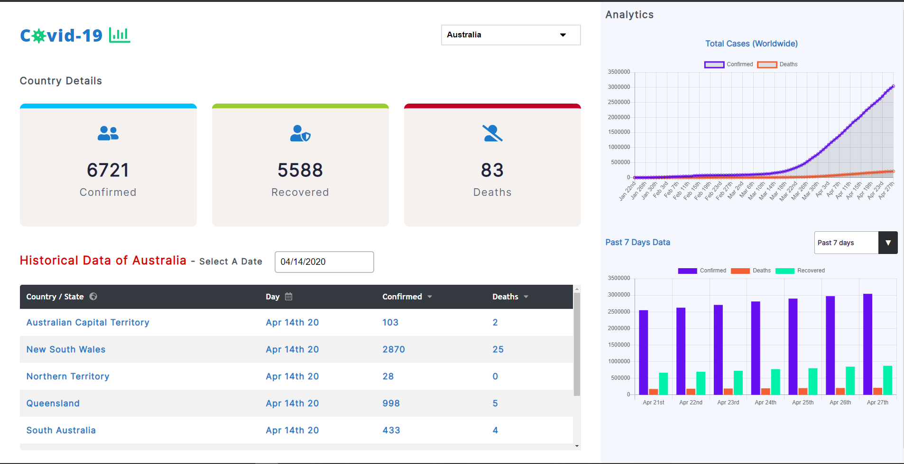

# Covid-19 Tracker Application / Dashboard- Tracks all Information about the confirmed Cases, Recovered Cases, & overall Deaths.

# Shows Overall Analytics (Worldwide)

# Shows Historical Data for past 7days/14days/21days

# Usage

1. User Can select Effected Countries from the dropdown, based on that the dashboard shows the current information

2. It also shows the states of that country with confirmed cases and deaths.

# Charts

1. Represents the overall data in graphical way.

2. User can also see past 7 days or 14 days or 21 days data in graph.

# Design

This project was bootstrapped with [Create React App](https://github.com/facebook/create-react-app).

### `npm start`

Runs the app in the development mode. 
Open [http://localhost:3000](http://localhost:3000) to view it in the browser.
